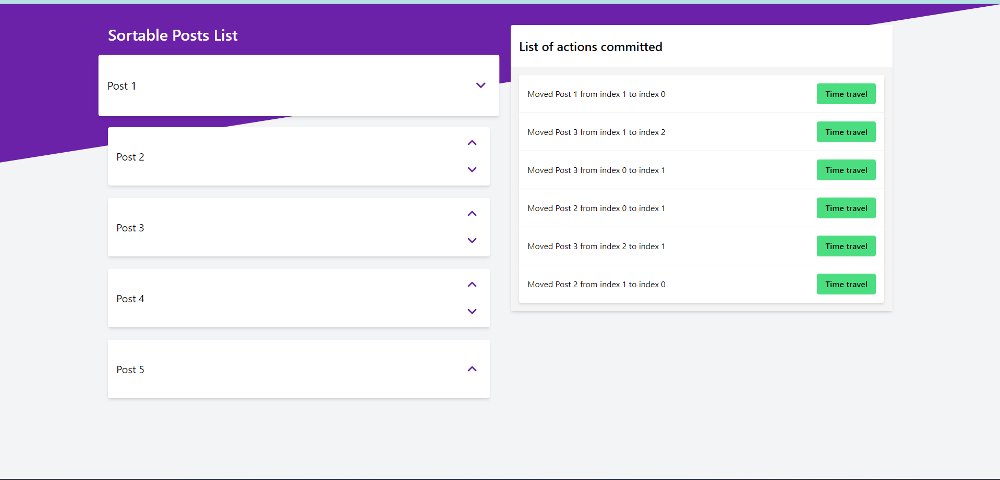

[](https://app.netlify.com/sites/cool-faloodeh-2520b5/deploys)

# Sortable Posts

Coding test for client, using Vue 3



## Scripts

```bash
# install dependencies
npm i

# run development server
npm run dev

# open cypress for integration testing
npm run cy:open

# run vitest for unit testing
npm run test:unit

# compile for production
npm run build

# run eslint
npm run lint
```
